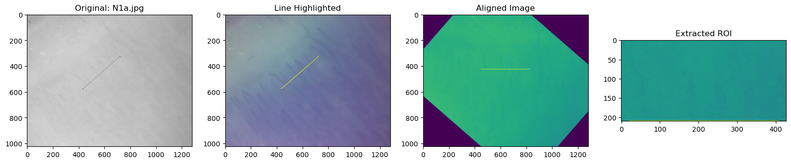

# Nailfold Capillaroscopy — Classical CV Pipeline for Capillary Detection & Counting

This repository contains a classical computer-vision pipeline for detecting and counting capillaries in nailfold capillaroscopy images. It implements a reproducible workflow built around OpenCV and scikit-image, including ROI extraction, adaptive image enhancement (HE/CLAHE), morphology-based segmentation, and geometric filtering (ellipse fitting + orientation & proximity checks). Results are compared with the available ground truth of the data used in this experimentation.

---

## Key Features

- Pure **classical CV** (OpenCV + scikit-image), **no learning** required
- **Automatic ROI alignment** using Hough line detection + rotation
- **Adaptive enhancement** with **Histogram Equalization** and **CLAHE** based on image luminance
- **Binary segmentation** with **adaptive thresholding** and **morphological refinement**
- **Ellipse fitting** for capillary-shaped contour selection
- **Orientation, aspect-ratio, proximity & slope checks** to reduce overcounting
- Jupyter notebook with **end‑to‑end visualizations**

---

## Repository Structure

```
.
├── main.ipynb                # End-to-end notebook: preprocessing → detection → counting → evaluation
├── capillary_detect.py       # Core analysis function(s): luminance, morphology, ellipse filtering, summary
├── utils.py                  # Utilities: rotation, ROI extraction, I/O helpers, enhancement helpers
├── Sameed_Qadeem_Project_Report.pdf  # Project report (method & evaluation)
└── README.md                 # You are here
```


## Environment Setup

This project has been tested on **Python 3.12**.  
You can set up the environment in one of the following ways:

---

### Option 1 — Using `environment.yml` (Recommended)

Create the conda environment
```bash
conda env create -f environment.yml
``` 
Activate it
```bash
conda activate nailfold
```
---

This will install:
- python 3.12
- opencv-python
- scikit-image
- scipy
- numpy
- matplotlib
- pandas
- jupyter

### Option 2 — Using pip and requirements.txt

Create a virtual environment

```bash
python -m venv .venv
source .venv/bin/activate     # On Windows: .venv\Scripts\activate
```

Install Dependencies

```bash 
pip install -r requirements.txt
``` 

## Data Expectations

- Input images are **RGB** nailfold capillaroscopy frames (e.g., `.png`, `.jpg`, `.tif`).
- The pipeline extracts the **green channel** and focuses on a **ROI just below the nailfold baseline**.
- You can organize your images in any folder; the notebook lets you select a path and batch process them.

Example layout:

```
data/
├── N1a.png
├── N1b.png
├── S2a.png
└── S3h.png
```

---

## ▶️ Quick Start (Notebook)

1. **Open** the project in a terminal and start Jupyter:
   ```bash
   conda activate nailfold
   jupyter notebook main.ipynb
   ```
2. **Run all cells** (Kernel → Restart & Run All) or step through the sections:
   - Imports & setup
   - Image loading
   - Baseline detection (Hough) → **rotation to horizontal**
   - **ROI extraction** below the baseline
   - **Adaptive enhancement** (HE/CLAHE) driven by luminance
   - **Thresholding & morphology** (dilate/open/close, hysteresis)
   - **Contour extraction & ellipse fitting**
   - **Filtering by angle & aspect ratio**
   - **Proximity/slope-based grouping** to avoid double counting
   - **Visualization** and **metrics** (capillary counts; differences vs. reference, std. dev. of errors)

> The notebook prints **per-image luminance** and **final counts** and shows overlay plots of detected capillaries on the ROI.


---

## ⚙️ Technical Pipeline

1. **Preprocessing**
   - Extract **green channel** (maximizes vessel contrast)
   - **Gaussian blur** → **Canny edges** → **Hough lines** to detect the **nailfold baseline**
   - Rotate to make the baseline horizontal and **extract a fixed-height ROI** below it

   

   Extracted ROI is displayed along with the original images for visual verification. This process is done for each image in the dataset

   


2. **Processing / Enhancement**
   - Compute **average luminance**
   - Apply **Histogram Equalization** + **CLAHE** (stronger when luminance is low)
   - **Adaptive Gaussian thresholding** to get a binary mask of bright elongated structures

   Above pipeline can be visualised below:

   

3. **Segmentation & Morphology**
   - **Dilation / opening / closing** to connect fragments and suppress noise
   - Optional **hysteresis thresholding** for continuity

   

4. **Analysis & Counting**
   - **Contour detection** → **ellipse fitting**
   - Filter by **orientation** (reject near-horizontal), **aspect ratio** (elongated only)
   - **Group fragments** by **centroid distance** and **slope (≈0.5–1.5)** to avoid overcounting
   - **Count unique capillary candidates** and visualize overlays

   Capillaries Detected on Normal Person Image: 

   

   Capillaries Detected on Diseased Person Image

   

---

## Reproducing Results & Metrics

The notebook includes:
- Per-image **luminance** prints (to explain enhancement decisions)
- Final **capillary counts** per image and a **summary dictionary**
- **Error analysis** vs. your reference counts, including **std. dev. of differences**

> Provide a CSV/dict of ground‑truth counts to enable the evaluation cells in `main.ipynb`.


---

## Project Paths & Parameters

- **ROI height** differs for certain cohorts (e.g., healthy vs. diseased) in the experiments. If your data differs, **tune** ROI height in `utils.py` and re-run.
- Morphology kernels and threshold constants (e.g., `low_thresh`, `high_thresh`) are set in `capillary_detect.py` and can be **adjusted** for your acquisition conditions.
- All visualizations use **Matplotlib**; overlays are generated for quick QC.

---

## Troubleshooting

- **No lines found / incorrect rotation** → Check Canny thresholds & Hough parameters; ensure images include the nailfold baseline.
- **Over/under-segmentation** → Adjust CLAHE `clipLimit`, threshold window, and morphology kernel sizes.
- **Double counting** → Increase centroid distance threshold or tighten slope range.
- **Very dim images** → Ensure the luminance-driven CLAHE branch is active; consider denoising before thresholding.

---

## 🙌 Acknowledgments

- Implementation based on standard OpenCV & scikit-image primitives.
- See the accompanying project report for methodology details and references.
- Thanks to my Professor Dr. Stephanie Bricq for guidance and my group member Qadeem Khan for the efforts in the project.

